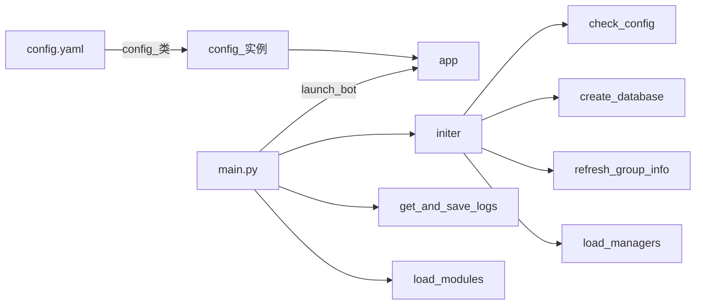

* main.py
* config.yaml
* log
  * INFO
  * ERROR
* modules
  * mod 1
  * mod 2
  * ...
* logs_and_events
  * 1
* randosoru(兰德索尔)
  * starter
  * managers
    * 加载重载卸载插件
    * 权限系统(咕咕咕)
    * 频率限制系统(咕咕咕)
  * orm
  * configs
  * resource

